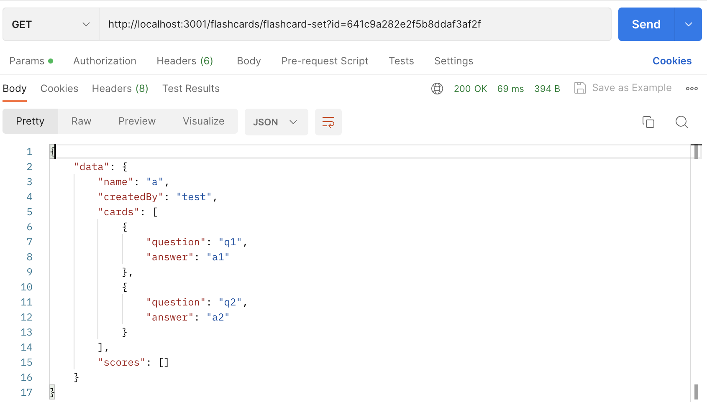

# This is a guide for expert users on how to build, check status of, and see progress of our product

## How to build product

### Precondition
install Node.js at https://nodejs.org/en/download/  
git clone https://github.com/maxpanec/Deepcourse.git  

### Update/Install packages
open terminal and navigate to root of project (/Deepcourse)  
cd dev  
cd backend  
npm install  
cd ../frontend/react_app  
npm install  

### Build React and Node apps
open terminal and navigate to root of project (/Deepcourse)  
cd dev  
cd backend  
node src  
open terminal and navigate to root of project (/Deepcourse)  
cd dev  
cd frontend/react_app  
npm start  

## How to check status of product
build the product using the steps above  
navigate to http://localhost:3000  
you can now interact with the product and see the status of it  

## How to check weekly progress of product
navigate to commit history https://github.com/maxpanec/Deepcourse/commits/main  

### See code changes
for a given commit on the commit history page click on the commit id to see code changes  

### See past repo state and viewing old build
for a given commit on the commit history page click on <> button to see repo at that commit point  
optionally download the repo  
optionally follow build and check status of product to view old build  

## How to test API endpoints
install Postman from https://www.postman.com  
find API endpoints in github directory https://github.com/maxpanec/Deepcourse/tree/main/dev/backend/src/routes  
each file in directory contains API endpoints  
each file contains the base url for the API endpoints at the top of the file  
each API endpoint has documentation for expected body or query parameters  
see example postman request below  

